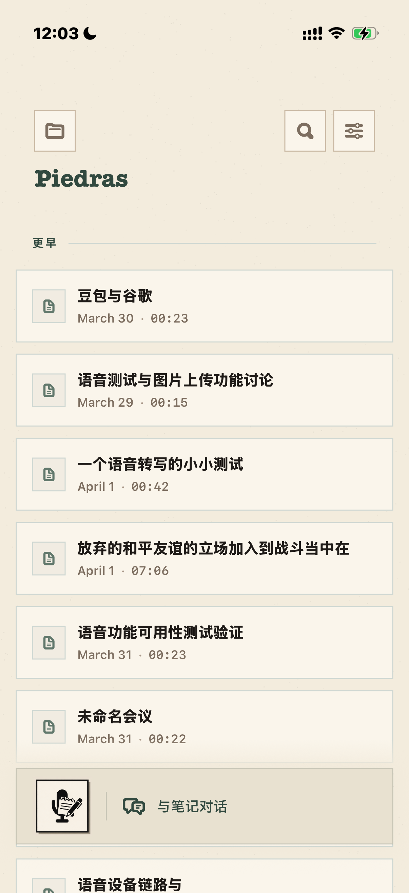
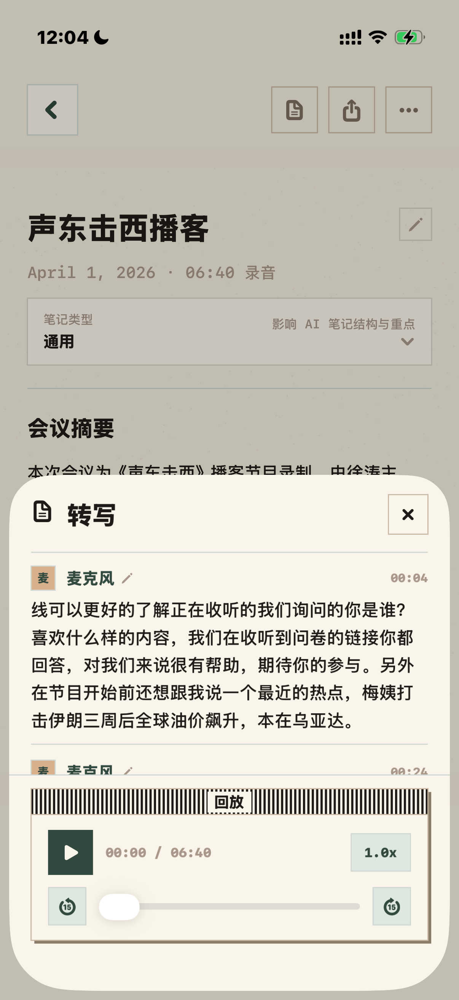
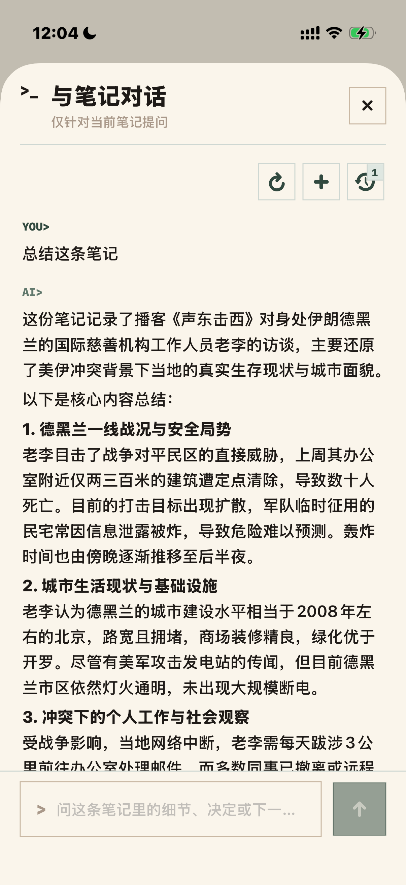
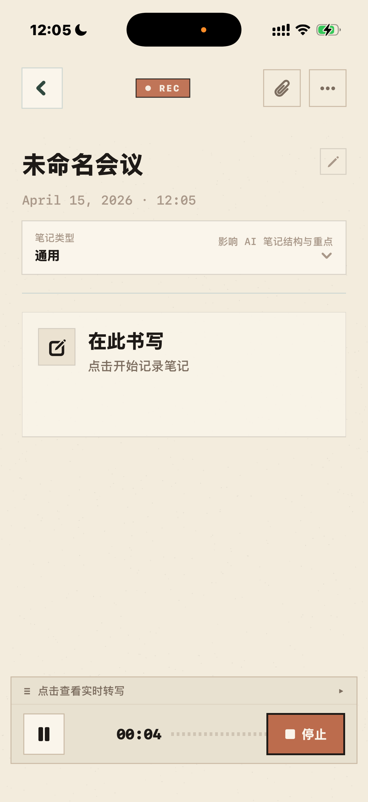

# Piedras / 椰子面试

`Piedras` is an iOS-first AI note-taking project for conversations, meetings, and long-form audio.

它不是一个“把语音转成文字”的小工具，而是一个围绕录音、转写、整理、提炼与追问构建的个人知识工作流产品原型。

英文说明见：[docs/README.en.md](docs/README.en.md)

---

### 项目简介

`Piedras / 椰子面试` 是一个以 iOS 为核心入口的 AI 会议记录与长音频理解项目，面向中文语境下真实的记录场景：会议、访谈、播客、直播、讨论和临时灵感。

我希望它解决的不是“录下来”这个动作本身，而是录完之后真正麻烦的部分：

- 如何快速得到可读的转写
- 如何在听的过程中自然补充笔记
- 如何把原始内容整理成结构化信息
- 如何围绕一条笔记继续追问、回看和复用
- 如何把历史记录逐渐沉淀成可搜索的个人上下文

这是一个开源作品集项目，但它同时也是一个可构建、可运行、可继续扩展的完整工程仓库。

### 产品思路

这个项目的核心判断很简单：

- 转写只是起点，不是终点
- 笔记不是附件，而是理解过程本身
- AI 的价值不在“代替记录”，而在于放大记录之后的整理和检索效率
- iOS 端体验应该足够轻，做到“打开就记，记完还能继续工作”

所以仓库最终形成了一个 `iOS app + cloud API + ASR proxy` 的组合：

- `iOS app` 负责录音、浏览、编辑、回放和问答交互
- `cloud API` 负责 AI 处理、数据同步、导出和服务端能力编排
- `ASR proxy` 负责实时语音转写链路接入

### 核心体验

- 原生 iOS 录音与转写流程，围绕“低摩擦开始记录”设计
- 详情页同时承载标题、转写、结构化笔记与附件上下文
- 支持实时转写查看与独立转写面板回看
- 支持 AI 笔记增强与面向单条记录的问答
- 支持历史记录列表与文件夹化组织
- 仓库同时包含客户端、云 API 和独立转写代理，适合展示完整产品工程链路

### 截图

| 首页 / Home | 转写详情 / Transcript |
| --- | --- |
|  |  |

| 录音中 / Recording | 与笔记对话 / Chat with note |
| --- | --- |
|  |  |

对应界面分别展示了：

- 记录列表与入口组织
- 单条笔记详情页与转写面板
- 录音进行中的写作状态
- 基于当前笔记内容的 AI 问答

### 仓库组成

- `CocoInterview/`: SwiftUI iOS 客户端
- `CocoInterviewRecordingWidget/`: 录音相关 Widget / Live Activity 目标
- `CocoInterviewTests/`: 单元测试
- `CocoInterviewUITests/`: UI 流程测试
- `cloud/api/`: Next.js + Prisma 云端 API
- `cloud/asr-proxy/`: 独立 ASR WebSocket 代理
- `docs/`: 项目文档与补充说明
- `scripts/`: 构建、验证与辅助脚本

### 工程实现

#### iOS

- SwiftUI
- 本地优先的数据与交互设计
- 面向真实用户路径的页面拆分与状态管理
- Widget / Live Activity 扩展能力

#### Cloud API

- Next.js
- Prisma
- PostgreSQL
- 面向 AI 总结、问答、同步与导出等服务端能力

#### Speech / AI

- 实时 ASR 代理链路
- 结构化 AI 笔记生成
- 基于单条记录上下文的问答
- 为后续跨记录检索与知识沉淀预留空间

### 为什么这个项目值得做

中文会议和长音频理解工具，真正难的部分往往不在 demo 首屏，而在完整工作流：

- 录音开始是否足够快
- 转写结果是否能继续被整理
- AI 输出是否和原始上下文真正连得上
- 用户是否能在会后继续使用这条记录，而不是看完就关掉

这个仓库想展示的正是这种“从产品判断到工程落地”的连续性，而不是单点功能堆叠。

### 本地开发

构建 iOS App：

```sh
xcodebuild -project CocoInterview.xcodeproj -scheme CocoInterview -destination 'platform=iOS Simulator,name=iPhone 17 Pro' build
```

运行 iOS 测试：

```sh
xcodebuild test -project CocoInterview.xcodeproj -scheme CocoInterview -destination 'platform=iOS Simulator,name=iPhone 17 Pro'
```

启动云端 API：

```sh
cd cloud/api
npm install
npx prisma generate
npm run dev
```

构建云端 API：

```sh
cd cloud/api
npm run build
```

验证 ASR 链路：

```sh
say -o tmp-asr-sample.aiff "你好，我在测试 Piedras 的实时转写能力。"
afconvert -f WAVE -d LEI16 tmp-asr-sample.aiff tmp-asr-sample.wav
node scripts/asr_smoke_test.mjs tmp-asr-sample.wav http://127.0.0.1:3000
```

### 配置说明

- iOS 客户端通过 `COCO_INTERVIEW_BACKEND_BASE_URL` 读取后端地址
- ASR smoke test 通过 `COCO_INTERVIEW_BACKEND_URL` 读取服务地址
- 当前公开仓库不内置生产环境后端地址，需要通过环境变量或构建配置显式注入

### 路线图

- 完善实时转写稳定性与异常恢复
- 继续打磨详情页的录音、编辑、回放一体化体验
- 加强基于当前笔记与历史记录的问答质量
- 丰富附件、分享、导出与知识归档能力
- 继续清理品牌与仓库命名，统一 `Piedras` 项目表达
- 逐步把“可运行原型”推向“更完整的个人产品”

### 已知限制

- 项目仍在快速演进，产品命名与部分目录结构保留了历史阶段痕迹
- 完整体验依赖外部后端与 ASR 服务，公开仓库默认不附带生产配置
- AI 与语音链路受第三方服务可用性、成本和网络环境影响较大
- 当前更适合作为作品集项目、研究原型和工程样本，而不是开箱即用的公共 SaaS

### 项目定位

如果把它看成一个开源项目，它提供了相对完整的代码与架构样本。

如果把它看成一个作品集项目，它展示的是：

- 我如何定义一个真实问题
- 我如何把体验重点落在 iOS 端
- 我如何把 AI、转写、笔记与检索串成一条产品链路
- 我如何把原型持续推进到可维护的工程形态
